# Tutorial 5

### JMeter Testing Results

- all-student request

Before Profling:

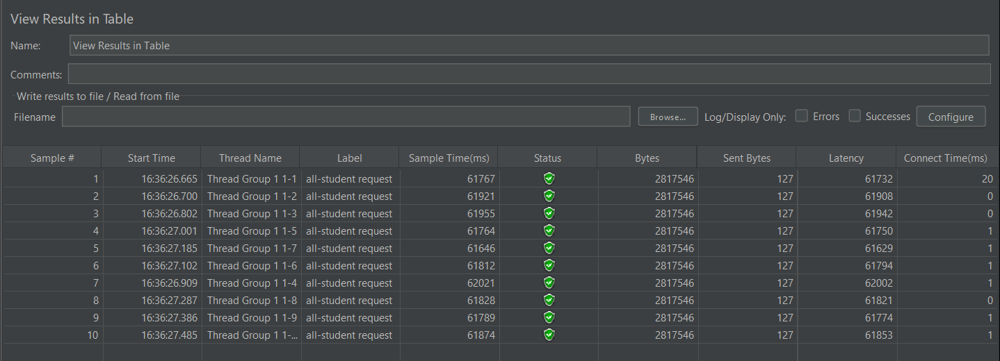

After Profiling:

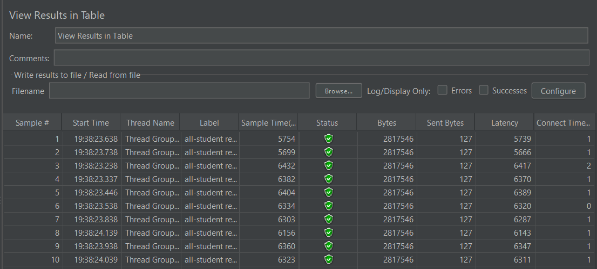

- all-student-name request

Before Profiling:

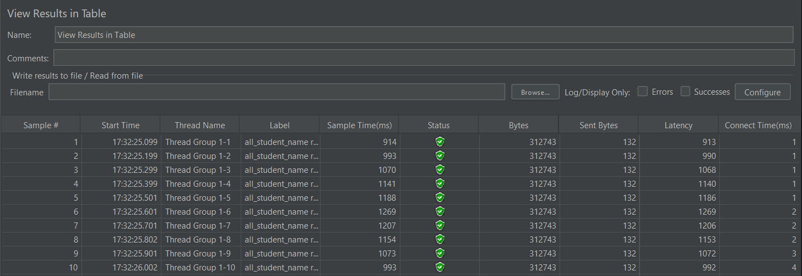

After Profiling:

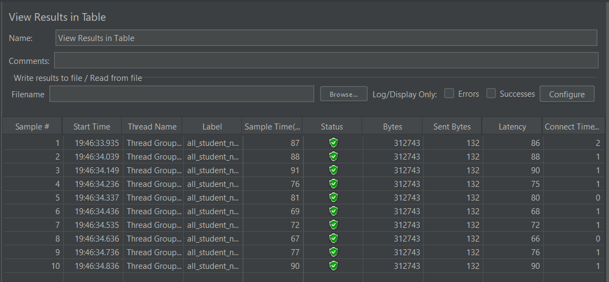

- highest-gpa request

Before Profiling:

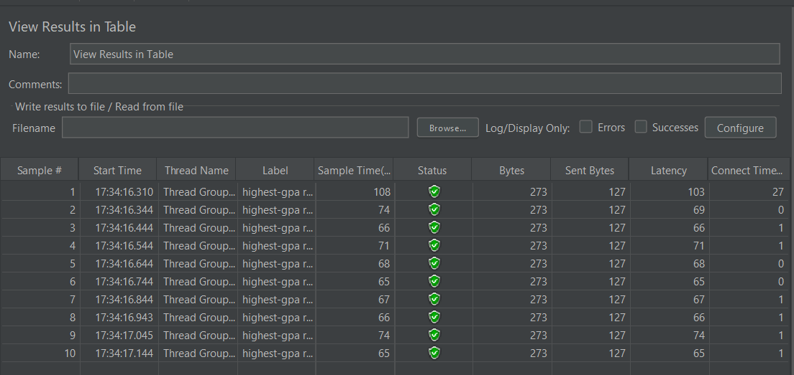

After Profiling:

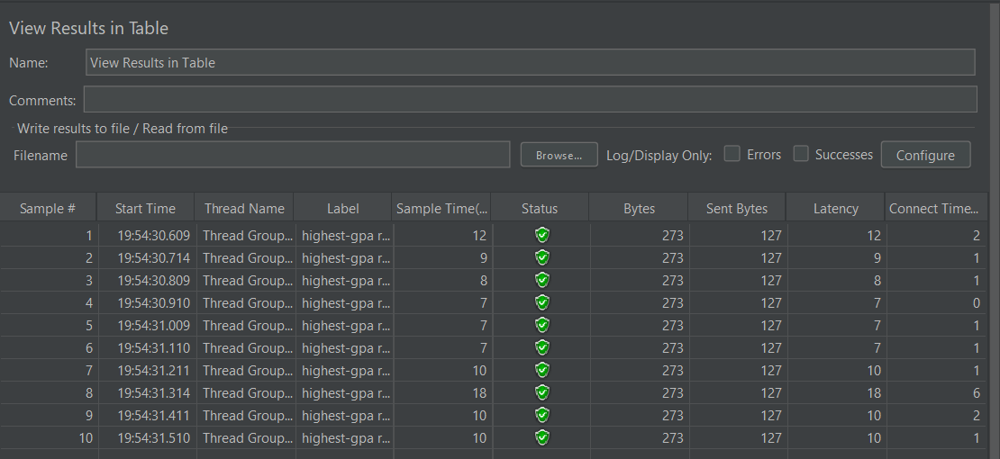

### Command Line Testing

- all-student request

Before Profiling:

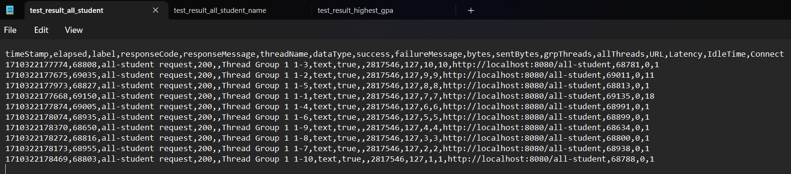

After Profiling:

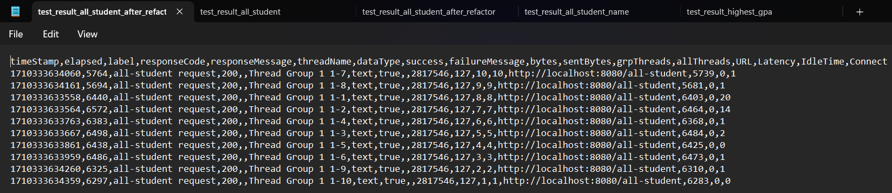

- all-student-name request

Before Profiling:

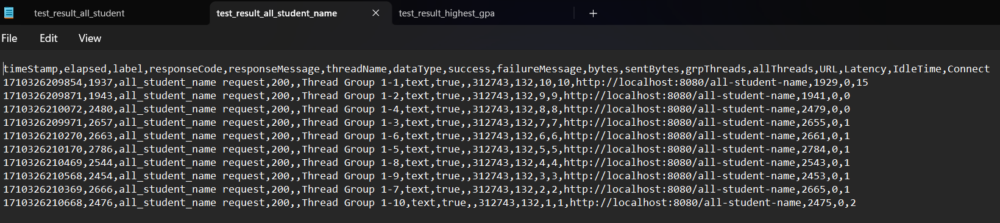

After Profiling:

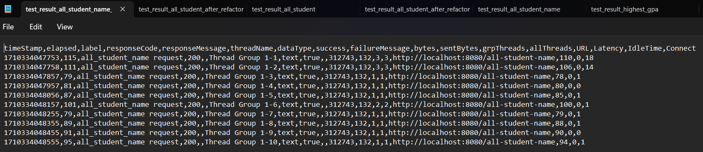

- highest-gpa request

Before Profiling:

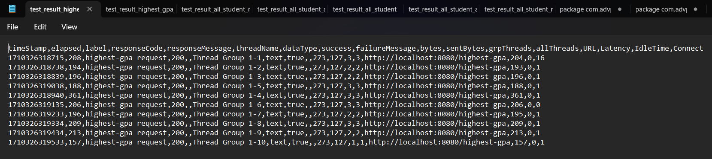

After Profiling:

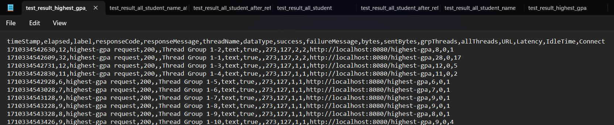

It can be seen that there's a huge improvement of performance after optimizing/profiling the methods used for all the requests.
Therefore, it is very beneficial to do profiling to the source code to improve the performance.

---

## Reflection
Please answer the following questions:

1. What is the difference between the approach of performance testing with JMeter and profiling with IntelliJ Profiler in the context of optimizing application performance?

Performance testing with JMeter focuses on simulating user interactions to evaluate an application's overall responsiveness under different loads. It operates externally, sending requests to the server and providing metrics like response time and throughput. JMeter is particularly useful for identifying bottlenecks related to server-side processes, database queries, and external dependencies, offering insights into system-level performance.

On the other hand, IntelliJ Profiler is a tool for profiling Java applications, working within the development environment by attaching to the running JVM. Profiling tools like IntelliJ provide detailed insights at the method and code level, allowing developers to pinpoint specific performance bottlenecks, memory issues, and CPU usage patterns. Profilers are valuable during development for optimizing algorithms, addressing memory leaks, and understanding internal behavior, complementing the high-level performance assessment provided by tools like JMeter. Together, they contribute to a comprehensive approach to application performance optimization.

2. How does the profiling process help you in identifying and understanding the weak points in your application?

Profiling is a tool for finding weak spots in my application. It gives me a close-up look at how my code runs, showing which methods are using a lot of resources and where the memory is going. With its real-time monitoring capabilities and resource assessments, profiling helped me to improve the performance of my code.

3. Do you think IntelliJ Profiler is effective in assisting you to analyze and identify bottlenecks in your application code?

I agree that IntelliJ Profiler is good in assisting me to analyze and identify bottlenecks on my code. It's really good at helping me figure out what's slowing down my code. It breaks things down in a way that's easy to understand, showing me exactly where the issues are. The tool's visuals on how long each part of my code takes to run helped a lot. Even so, I think there are things that can be improved. I myself was a bit confused on using it because there were little guide on how to use it.

4. What are the main challenges you face when conducting performance testing and profiling, and how do you overcome these challenges?

I found it a little bit hard to use the IntelliJ Profiler even though it is good. I didn't understand the flame graph and method list, which method are bottlenecking the code. IntelliJ doesn't have built in guide for me to understand the profiler. More over, even after identifying the bottleneck it is still hard to find the solution or optimization of the problem.

5. What are the main benefits you gain from using IntelliJ Profiler for profiling your application code?

The cool thing about this profiler is that it shows you a visual map of your code's performance. It highlights areas that could be working better, like spots where your computer might be struggling. IntelliJ IDEA's integrated profiler serves as a valuable tool for software developers, aiding in the optimization of code performance.

6. How do you handle situations where the results from profiling with IntelliJ Profiler are not entirely consistent with findings from performance testing using JMeter?

I will first analyze what could be the cause of the difference. Then, I will try to search the solution in the internet. I'll try checking if I'm using the same test environment, whether there are difference in the code I test.

7. What strategies do you implement in optimizing application code after analyzing results from performance testing and profiling? How do you ensure the changes you make do not affect the application's functionality?

When optimizing application code post-performance testing and profiling, it's vital to first pinpoint performance bottlenecks, whether they're related to CPU usage, memory management, or database queries. Code review and refactoring are essential for maintaining clean and efficient code, since they can boost the code performance. After doing the changes, it is good to do unit testing to ensure the code doesn't change in functionality. Manual check can also be done if possible.

